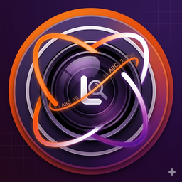

# 📸 Ubuntu Lens

Ubuntu için geliştirilmiş, yerel (çevrimdışı) çalışan, akıllı OCR destekli gelişmiş bir fotoğraf görüntüleyici ve metin seçme aracıdır. PyInstaller ile bağımlılıkları sistem kütüphanelerine bağlanarak optimize edilmiş olup, oldukça hafif (low-footprint) ve yüksek performanslı çalışır.



## ✨ Özellikler

* **Akıllı OCR Teknolojisi:** Ekrandaki resimlerde bulunan metinleri, API anahtarlarını ve kod bloklarını otomatik olarak algılar ve seçilebilir hale getirir.
* **Gelişmiş Zoom Mekanizması:** Fare tekerleği (`Scroll`) ile imlecin olduğu noktaya odaklı dinamik yakınlaştırma/uzaklaştırma.
* **Duyarlı (Responsive) Arayüz:** Pencere boyutu değiştiğinde veya tam ekran yapıldığında görüntüyü ve mevcut zoom oranını matematiksel olarak koruyan akıllı viewport.
* **Ubuntu Entegrasyonu:** Sisteme kurulduğu andan itibaren resim dosyalarına sağ tıklandığında "Birlikte Aç" menüsünde otomatik olarak listelenir.
* **Hafif ve Hızlı:** Ağır kütüphaneler ikili (binary) içerisine gömülmediği için düşük donanımlı cihazlarda bile anında (cold start gecikmesi olmadan) açılır.

## 🛠️ Sistem Bağımlılıkları

Uygulama arka planda metin analizi için **Tesseract OCR** motorunu kullanır. Kurulum sırasında paket yöneticisi bu bağımlılıkları otomatik olarak çözmektedir.

* `tesseract-ocr`
* `tesseract-ocr-eng` (İngilizce dil paketi)
* `tesseract-ocr-tur` (Türkçe dil paketi)

## 🚀 Kurulum (.deb Paketi ile)

Projenin derlenmiş en güncel `.deb` paketini indirip sisteminize tek komutla kurabilirsiniz:

```bash
sudo apt install ./ubuntu-lens_1.0.0_amd64.deb
```
Kurulum bittikten sonra Ubuntu uygulama menüsünde "Ubuntu Lens" adıyla aratabilir veya herhangi bir resme sağ tıklayıp varsayılan uygulama olarak atayabilirsiniz.
📦 Geliştiriciler İçin: Yeniden Paketleme (Debian Build)

Eğer kod üzerinde değişiklik yaptıysanız ve paketi yeniden üretmek istiyorsanız aşağıdaki adımları takip edin:

    Bağımlılıkları Kurun (Sanal Ortamda yapılması önerilir):

```bash
pip install pyinstaller PyQt5 opencv-python-headless pytesseract
```

    PyInstaller ile Temiz Derleme Yapın:

```bash
pyinstaller --noconfirm --windowed --name="ubuntu_lens" main.py
```

    Otomatik Paketleme Sihirbazını Çalıştırın:
    Dizindeki build.sh betiğine çalışma izni verip tetikleyin:

```bash
chmod +x build.sh
./build.sh
```

İşlem bittiğinde yeni ubuntu-lens_1.0.0_amd64.deb paketiniz kök dizinde hazır olacaktır.
📝 Lisans

Bu proje MIT lisansı altında açık kaynak olarak sunulmuştur. İstediğiniz gibi geliştirebilir ve dağıtabilirsiniz.
